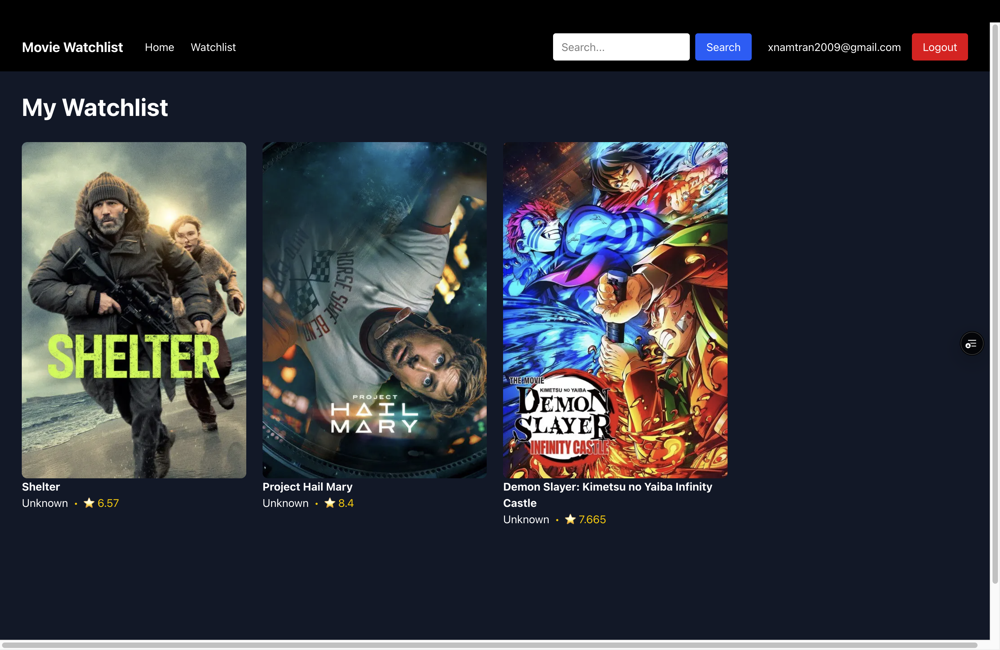

# Movie Watchlist V2

A full-stack movie discovery and watchlist app built with Next.js, React, Supabase, and the TMDB API.

## Features

- Browse popular movies with responsive grid layout
- Search for movies by title
- View detailed movie information (runtime, genres, overview, cast with photos)
- Watch official trailers with video dropdown selector
- User authentication with Supabase
- Per-user watchlist — save movies and manage your collection

## Tech Stack

- **Frontend**: Next.js 16, React, TypeScript, Tailwind CSS
- **Database**: Supabase (PostgreSQL + Row Level Security)
- **Authentication**: Supabase Auth
- **Image Optimization**: Next.js Image component
- **API**: TMDB (The Movie Database) API
- **Deployment**: Vercel

## Live Demo

[Your deployed Vercel URL will go here]

## Getting Started

### Prerequisites
- Node.js 18+
- TMDB API key (free at https://www.themoviedb.org/settings/api)
- Supabase account (free tier at https://supabase.com)

### Environment Variables

Create `.env.local` in the root:
```
NEXT_PUBLIC_SUPABASE_URL=your_supabase_url
NEXT_PUBLIC_SUPABASE_ANON_KEY=your_supabase_anon_key
TMDB_API_KEY=your_tmdb_api_key
```

## Project Structure
```
src/
├── app/
│   ├── page.tsx              ← Home (popular movies)
│   ├── search/page.tsx       ← Search results
│   ├── movie/[id]/page.tsx   ← Movie detail with trailer
│   ├── watchlist/page.tsx    ← User's watchlist (protected)
│   ├── login/page.tsx        ← Login
│   ├── signup/page.tsx       ← Sign up
│   ├── layout.tsx            ← Root layout with Navbar
│   ├── loading.tsx           ← Loading skeleton
│   └── globals.css
├── components/
│   ├── Navbar.tsx            ← Search bar, auth links
│   ├── MovieCard.tsx         ← Movie poster card
│   ├── VideoPlayer.tsx       ← Trailer player with dropdown
│   └── WatchlistButton.tsx   ← Add/remove from watchlist
└── lib/
    ├── tmdb.ts               ← TMDB API functions
    ├── supabase.ts           ← Supabase client
    └── types.ts              ← TypeScript interfaces
```

## Pages

- **Home** (`/`) - Browse popular movies
- **Search** (`/search?query=...`) - Search and filter results
- **Movie Detail** (`/movie/[id]`) - Full movie info, cast, trailer
- **Watchlist** (`/watchlist`) - Your saved movies (login required)
- **Login** (`/login`) - Sign in to your account
- **Sign Up** (`/signup`) - Create new account

## Key Features

- **Per-User Watchlist**: Supabase Row Level Security so users only see their own data (Tho I have not dealt with security before)
- **Official Trailers**: Automatically sorts and displays official trailers first (Entirely AI'd though)
- **Responsive Design**: Tailwind CSS
- **Type Safety**: TypeScript support for better DX although it may be lacking in some areaas

## What I Learned

- Next.js 16 App Router and server/client components
- BASIC Supabase authentication and database with RLS
- BASIC TypeScript interfaces and type safety
- Responsive design with Tailwind CSS
- Managing external API data (TMDB)
- State management with React hooks

---

Built as a portfolio project for full-stack development.

## Screenshots


